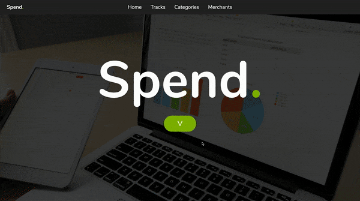

# Spend - Spending Tracker

Spend is a web-app, allowing users to track their spending to have better control over their finances.

## Setup

```
bundle install
ruby db/seeds.rb
ruby app.rb
```

## Demo



### Technologies

Sinatra | Ruby, PostgreSQL

### Features

- Dynamic budget warnings and insights into the user's spending patterns

- Add and manage tracks (purchases), merchants and categories

- Edit budget to adapt to new financial constraints

### Brief

- The app should allow the user to create, edit and delete merchants, e.g. Tesco, Amazon, ScotRail

- The app should allow the user to create, edit and delete tags for their spending, e.g. groceries, entertainment, transport

- The user should be able to assign tags and merchants to a transaction, as well as an amount spent on each transaction.

- The app should display all the transactions a user has made in a single view, with each transaction's amount, merchant and tag, and a total for all transactions.
